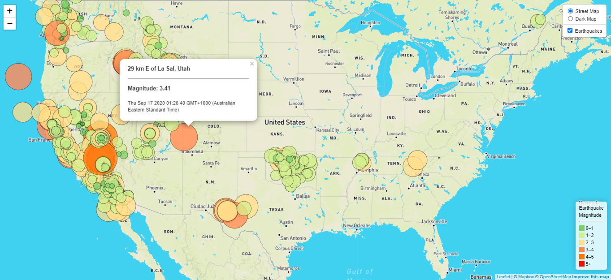

# An interactive map with Leaflet

In this project we designed an interactive map using Javascript, Leaflet, HTML/CSS.

This maps shows the earthquakes that happened over the last seven days and their magnitude. 
You can visualise it here:https://babetteblanquet.github.io/Leaflet_Interactive_map/

When you click on each circle, you can get more information about:
  - the location
  - the magnitude
  - the date
  

  
## The data ##
The earthquake data is pulled from [USGS GeoJSON Feed](https://earthquake.usgs.gov/earthquakes/feed/v1.0/geojson.php) and updates every five minutes.
The map renders earthquakes in real-time.

## How to read our code ##

In this directory you will find:
- index.html - the webpage
- in static/js/logic.js the javascript code 
- in static/css/style - the CSS

You need to run python -m http.server to visualise the map. This will host the page at localhost:8000 in your web browser.

